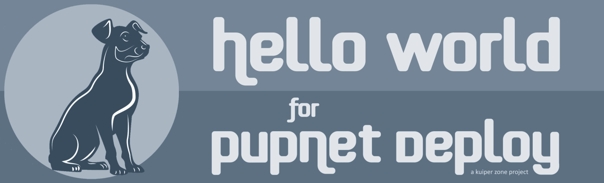
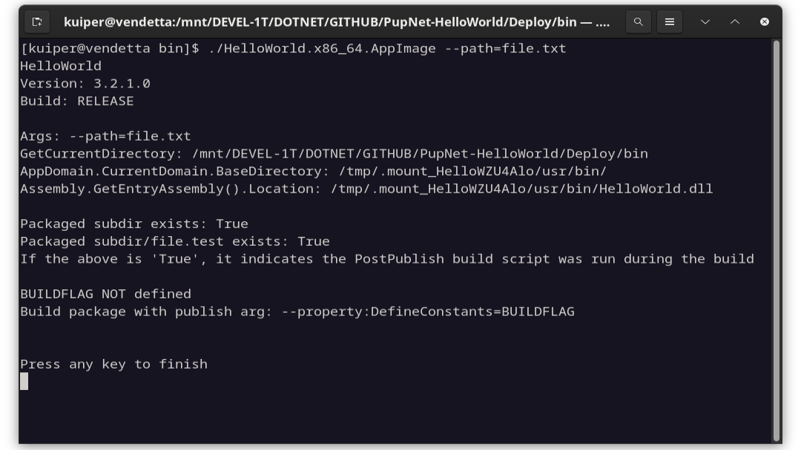

    

# Hello World for PupNet Deploy #

## Introduction ##

**Hello World** is a C# demonstration project for use with the [PupNet Deploy](https://github.com/kuiperzone/PupNet-Deploy)
command-line utility.

### What is PupNet Deploy? ###
**PupNet** is cross-platform deployment utility that will publish your .NET project and package the output as a
ready-to-ship installation file in a single step.

## About this Application ##

Hello World demonstrates all the major features of building distributable packages with PupNet.
It can be built for all package kinds, including AppImage, Flatpak, DEB and RPM formats on Linux,
and as a Setup file on Windows. It provides an example of using desktop and AppStream metadata files,
as well as icons and a post-publish script.

You will notice, for example, that it has an AppStream metadata file and associated desktop file make
use of macro variables for a high degree of content automation, so that information need only be
specified once in the primary configuration.

    

On execution, the Hello World program displays command arguments and assembly information. The assembly
version confirms that version information may be provided in the deployment configuration, and passed through
the build system, to the application.

## Instructions ##

Clone this repository to your local drive.

Install [PupNet Deploy](https://github.com/kuiperzone/PupNet-Deploy), along with prerequisites.

At the solution directory, under Linux:

    pupnet -k appimage

    pupnet -k flatpak

    pupnet -k deb

    pupnet -k rpm

Under Windows:

    pupnet -k setup

See the [PupNet Deploy Project](https://github.com/kuiperzone/PupNet-Deploy) for complete instructions and information.

**PupNet Deploy** was created by Andy Thomas at [https://kuiper.zone](https://kuiper.zone).

If you like this project, don't forget to like and share.