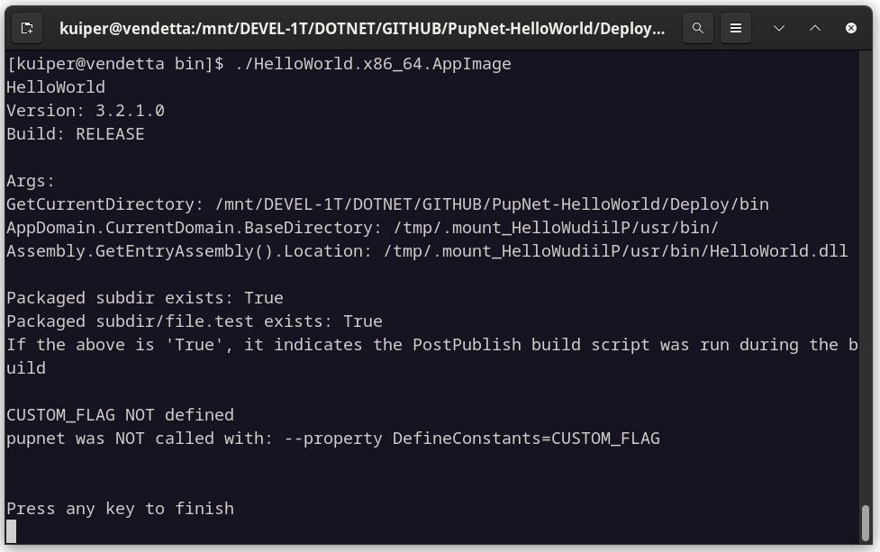

    

# Hello World for PupNet Deploy

## Introduction

**Hello World** is a C# demonstration project for use with the [PupNet Deploy](https://github.com/kuiperzone/PupNet-Deploy)
command-line utility.

### What is PupNet Deploy?
**PupNet Deploy** is a cross-platform deployment utility which publishes your .NET project and
packages it as a ready-to-ship installation file in a single step.

## About this Application

Hello World demonstrates all the major features of building distributable packages with PupNet.
It can be built for all package kinds, including AppImage, Flatpak, DEB and RPM formats on Linux,
and as a Setup file on Windows. It provides an example of using desktop and AppStream metadata files,
as well as icons and post-publish scripts.

You will notice, for example, that it has an AppStream metadata file and associated desktop file, both
of which make use of macro variables for a high degree of content automation, so that information need
only be specified once in the primary configuration.

    

On execution, the Hello World program displays command arguments and assembly information. The assembly
version confirms that version information may be provided in the deployment configuration, and passed through
the build system, to the application.

## Instructions

Clone this repository to your local drive.

Install [PupNet Deploy](https://github.com/kuiperzone/PupNet-Deploy), along with its prerequisites.

### Under Linux

At the solution directory:

    pupnet --kind appimage
    pupnet -k flatpak
    pupnet -k deb
    pupnet -k rpm

The package output kind defaults to `appimage` if omitted under Linux.

### Under Windows

At the solution directory:

    pupnet -k setup

It defaults to `setup` if omitted under Windows.

## RUNNING THE APP
The application runs in the terminal, so run the program from the command-line rather than double-clicking from
a file manager to see the output.

As AppImage:

    ./HelloWorld.x86_64.AppImage

Flatpak:

    Install: `flatpak install HelloWorld-1.0.4-2.x86_64.flatpak`
    Run: `flatpak run zone.kuiper.helloworld`
    Uninstall: `flatpak uninstall zone.kuiper.helloworld`

With RPM or Debian package installed, simply:

    helloworld

## BUILD WITH PROPERTIES
The program prints different output according to whether the `#FLAG1` and `#FLAG2` macros are defined.
This is intended to test that we can successfully pass properties during the pupnet build.

To test set both flags at command line:

    pupnet --property DefineConstants=FLAG1,FLAG2

Use a comma (not semi-colon) and do not put a space between the values.

In this case, the Hello World program will output the following when built and run:

    FLAG1 defined OK!!!
    pupnet was called with: --property DefineConstants=FLAG1;

    FLAG2 defined OK!!!
    pupnet was called with: --property DefineConstants=FLAG2;

See the [PupNet Deploy Project](https://github.com/kuiperzone/PupNet-Deploy) for complete instructions and information.
